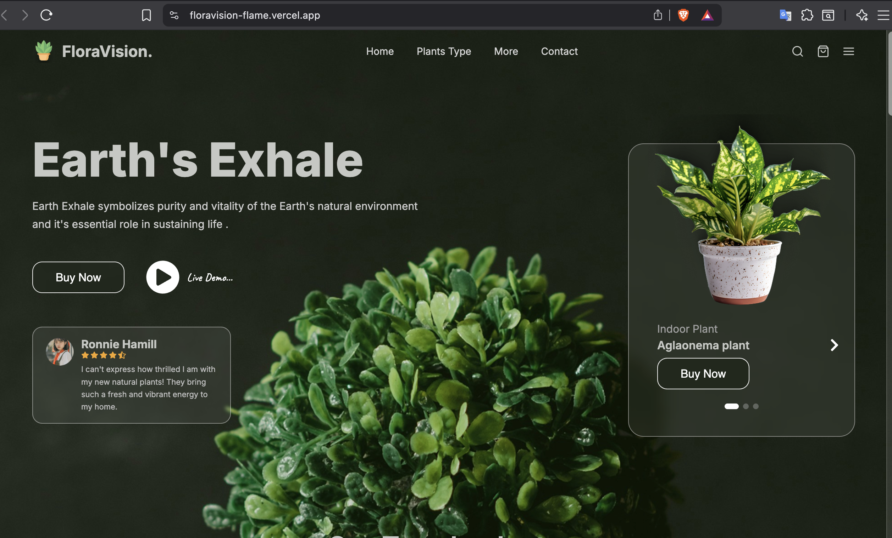

# 🌿 FloraVision

A modern plant e-commerce landing page built with **React + Vite**, featuring a dark botanical aesthetic, smooth UI components, and fully responsive design. Components are fully prop-driven — all data and assets are managed from a single `Home.jsx` entry point.




## Preview

> A full-page plant store UI with hero section, product listings, customer reviews, and more — all on a rich dark green theme.


## Tech Stack

- **React 18** — Component-based, prop-driven UI
- **Vite** — Lightning-fast dev server & bundler
- **CSS Modules** — Per-component scoped stylesheets
- **React Icons** — Icon library (Fi, Fa, Lu, Bi sets)
- **Google Fonts** — Inter + Caveat typefaces

---

## 📁 Project Structure

```
floravision/
├── public/
├── src/
│   ├── assets/              # Images (plants, avatars, corner frames, etc.)
│   ├── components/
│   │   ├── Navbar.jsx
│   │   ├── Hero.jsx
│   │   ├── Trendy.jsx
│   │   ├── Topselling.jsx
│   │   ├── Customerreview.jsx
│   │   ├── BestO2.jsx
│   │   └── Footer.jsx
│   ├── pages/
│   │   └── Home.jsx         # All data arrays & asset imports live here
│   ├── styles/
│   │   ├── index.css
│   │   ├── App.css
│   │   ├── Navbar.css
│   │   ├── Hero.css
│   │   ├── Trendy.css
│   │   ├── Topselling.css
│   │   ├── Customerreview.css
│   │   ├── BestO2.css
│   │   └── Footer.css
│   ├── utils/
│   │   └── scrollTo.js      # Smooth scroll helper
│   ├── App.jsx
│   └── main.jsx
├── index.html
├── package.json
└── vite.config.js
```

---

## Getting Started

### Installation

```bash
# Clone the repository
git clone https://github.com/your-username/floravision.git

# Navigate into the project
cd floravision

# Install dependencies
npm install
```

### Running Locally

```bash
npm run dev
```

Open [http://localhost:5173](http://localhost:5173) in your browser.

### Build for Production

```bash
npm run build
```

##  Deployment

This project is live on **Vercel** → [floravision-flame.vercel.app](https://floravision-flame.vercel.app)

##  Features

- **Hero Section** — Full-screen background image with plant card and review snippet
- **Trendy Plants** — Alternating layout cards with floating plant images
- **Top Selling** — 3 column product grid with price and cart button
- **Customer Reviews** — 3 card review grid with star ratings and avatars
- **Best O2 Plants** — Feature section highlighting air-purifying plants with slide counter
- **Footer** — Brand info, quick links, and email subscription input
- **Responsive** — Mobile friendly layout across all sections


##  Component Props

All components are purely presentational. Assets and data are imported once in `Home.jsx` and passed down as props.


## Notes

- The hero background image (`heroPlant.png`) is intentionally kept as a CSS `background-image` on `.heroBg` in `App.css` — passing it as a prop caused rendering issues, so it's managed purely through CSS.
- To update any plant image or review, edit the data arrays at the top of `src/pages/Home.jsx`.
